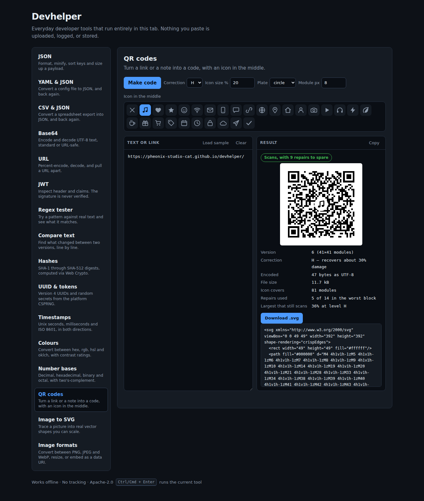

# Devbox

Everyday developer tools that run entirely in your browser tab. JSON, CSV,
Base64, URLs, JWTs, hashes, UUIDs, timestamps, colours, number bases and image
conversion — computed locally, with no server involved.



## Why

The tools in here are the ones you reach for a dozen times a week, and the
usual answer is to paste your data into a random website. That website sees
your production JSON, your access token, and the payload you were debugging.

Devbox does the same work with the same convenience, except the page is static:
it makes no network requests after loading, so nothing you paste can leave the
tab. Once loaded it works offline, and it deploys anywhere that can serve three
static files.

## Tools

| Tool | What it does |
| --- | --- |
| **JSON** | Format, minify, sort keys recursively, and report type, key count, nesting depth and byte size. Syntax errors are reported with a line and column. |
| **Base64** | Encode and decode UTF-8 text, standard or URL-safe. Decodes to a hex dump when the bytes are not text. |
| **URL** | Percent-encode and decode, split a URL into its components, and list query parameters — including repeated keys, which most parsers collapse. |
| **JWT** | Decode the header and claims, and convert `iat` / `nbf` / `exp` into readable dates with an expiry badge. |
| **Hashes** | SHA-1, SHA-256, SHA-384 and SHA-512 via the Web Crypto API, individually or all at once. |
| **UUID & tokens** | Version 4 UUIDs and random secrets in hex, base64url or alphanumeric, drawn from the platform CSPRNG. |
| **Timestamps** | Unix seconds, Unix milliseconds and ISO 8601 in both directions, plus local time and a relative description. |
| **CSV & JSON** | Both directions, with RFC 4180 quoting, delimiter detection, and optional typing of numbers and booleans. |
| **Colours** | Hex, rgb, hsl and oklch, plus WCAG contrast rated separately against white and black. |
| **Number bases** | Decimal, hex, binary and octal via BigInt, with the two's-complement reading at 8/16/32/64 bits. |
| **Image to SVG** | Traces a picture into real vector paths, or wraps it unchanged when that is what you need. |
| **Image formats** | PNG, JPEG and WebP with a quality setting, resizing, and data-URI output. |

Images are read with the canvas API and never leave the tab either — drop one
on the panel, or paste it from the clipboard.

`Ctrl`/`Cmd` + `Enter` runs the active tool. Every tool has a deep link
(`#json`, `#jwt`, …), and each panel keeps what you typed while you switch tabs.

## Getting started

```bash
npm install
npm run dev        # dev server on http://localhost:5173
npm test           # unit tests
npm run build      # typecheck + production bundle in dist/
```

## Design decisions

**No runtime dependencies.** Everything ships as hand-written TypeScript,
including the colour quantiser and the contour tracer; the whole bundle is
roughly 38 kB before compression. `vite`, `typescript` and `vitest` are the
only packages, and all three are build-time only.

**Tracing is not magic.** `src/tools/vectorize.ts` reduces an image to a
palette, walks the outline of every resulting region along pixel edges, and
simplifies those outlines with Douglas–Peucker. Flat artwork — logos,
screenshots, line drawings, diagrams — comes out clean and genuinely scalable.
A photograph does not: continuous tone has no outlines to find, so it becomes a
heap of colour blobs. The panel offers "Wrap unchanged" for the cases where
embedding the picture in an SVG is really what was wanted.

**Nothing you type is persisted.** Only the name of the tool you last used is
written to `localStorage`, so the app opens where you left off. Inputs are never
stored — a JWT or a secret you paste lives in the tab and disappears with it.

**Logic is separated from the DOM.** `src/tools/` holds pure functions that take
strings and return a `Result<T>`; `src/panels/` wires them to the interface.
That is why the tests cover behaviour rather than markup.

**Signatures are not verified.** The JWT panel decodes and never validates —
verification needs the signing key, which does not belong in a browser tab. The
panel says so on screen.

## Deployment

The build is a static bundle, so any static host works. `vite.config.ts`
defaults `base` to `/devbox/` for GitHub Pages project sites; override it
when deploying elsewhere:

```bash
BASE_PATH=/ npm run build
```

GitHub Pages has two modes, and this repository is set up to work under both.

**GitHub Actions** runs `.github/workflows/pages.yml`, which builds the project
and publishes `dist/`. This is the mode to prefer.

**Deploy from a branch** ignores the build entirely and serves the repository as
it stands. That is why the root `index.html` is a *generated, self-contained
build* — the whole app inlined into one file, with no asset requests and no base
URL to get wrong. `scripts/build-standalone.mjs` writes it, `npm run build` runs
that script, and CI fails if the committed copy has gone stale. Do not edit it
by hand; the source page it is generated from lives at `app/index.html`.

The two modes can also race: both deployments trigger on a push to `main`, and
whichever finishes last wins. With a prebuilt root page it no longer matters
which one that is.

## Project layout

```
app/index.html    the page Vite builds from
index.html        generated single-file build, committed for branch-mode Pages
scripts/          the generator for that file
src/tools/        pure logic, one module per tool, each with tests
src/panels/       one UI panel per tool
src/workbench.ts  shared input/output scaffolding
src/main.ts       app shell, navigation, deep links
```

Adding a tool means writing a module in `src/tools/`, a panel in `src/panels/`,
and registering it in `src/panels/index.ts`.

## License

Apache-2.0 — see [LICENSE](LICENSE).
